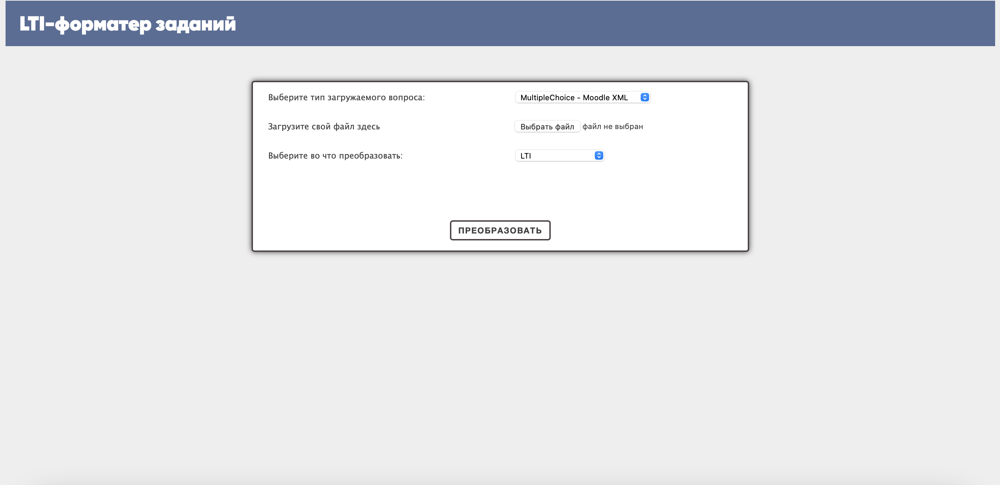

# LTI-форматтер автоматически проверяемых заданий
Курсовая работа. 2 курс ФКН ПИ. Илья Тямин

## Как запустить?
Представленное приложение к исследованию является веб-сервисом, написанным на Python с использованием Django. Для запуска проекта можно
1. Воспользоваться командной строкой. Для этого, необходимо перейти в директорию с проектом и написать следующее:
```bash
python manage.py runserver
```
2. Открыть проект в IDE (например, PyCharm) и уже там запустить проект.

### Как пользоваться?
Интерфейс веб-сервиса выглядит следующим образом:


Пользователю предлагается выбрать тип загружаемого вопроса из списка предложенных, далее загрузить сам файл и выбрать в какой тип преобразовать. По умолчанию, файл преобразовывается в разработанный LTI-формат, однако также есть и поддержка преобразований в другие форматы.

В случае, если пользователь хочет выгрузить вопросы из Canvas Instructure, то ему вместо файла необходимо указать уникальный идентификатор курса и уникальный идентификатор вопроса. Кроме того, он должен предоставить доступ к сервисному аккаунту `ltiformmatters@gmail.com` для корректной работы сервиса. Вся эта информация также отображена на экране при выборе соответствующего пункта.

### Что дальше?
После преобразования, пользователю будет предложено или скопировать полученный файл или загрузить его в том формате, в котором он выбрал.